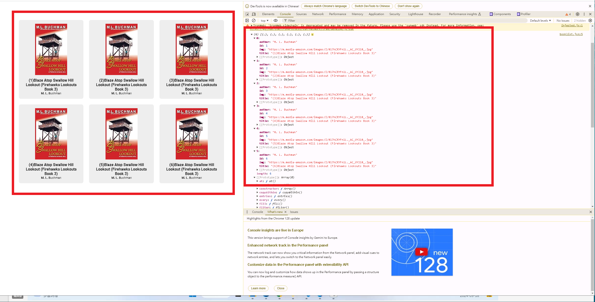
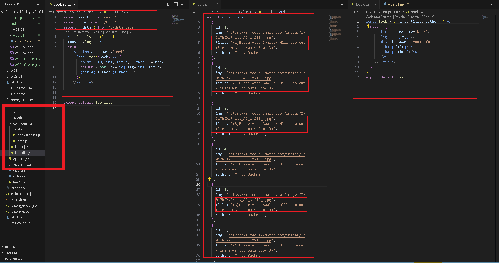
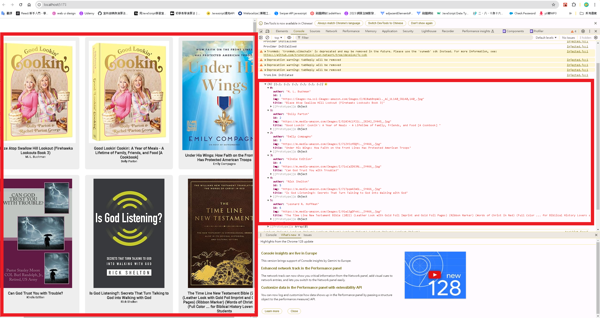

[GITHUB](https://github.com/haowei212410061/1131-wp1-demo-61)

### W02-P1: Github share to teacher and TA(sian-0018)


#### => W02-P2: Show 6 <book /> in React with responsive


#### w02-P3:Create books_data as json array and put it into <Bookslit_61/>, then create 6 <book_61 />




#### w02-P4: Get 6 different book data , adn show these 6 data correctly




```
dcf3873 haowei  Wed Sep 18 20:59:28 2024 +0800  w02-P3:Create books_data as json array and put it into <Bookslit_61/>, then create 6 <book_61 />
d035d4d haowei  Wed Sep 18 19:52:52 2024 +0800  W02-P2: Show 6 <book /> in React with responsive
b725d6f haowei  Wed Sep 18 19:52:35 2024 +0800  W02-P1: Github share to teacher and TA(sian-0018)
00d8a9a haowei  Wed Sep 18 19:50:45 2024 +0800  use school account to login
f6782df haowei  Wed Sep 18 19:48:07 2024 +0800  use school account to login
11f06e3 haowei0218      Wed Sep 18 19:45:34 2024 +0800  W02-P1: Github share to teacher and TA(sian-0018)
```
