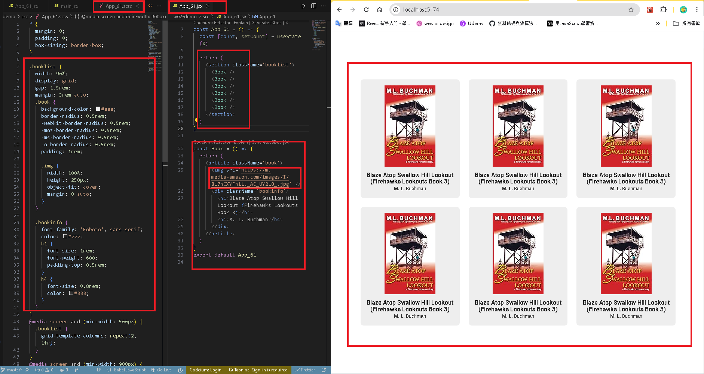
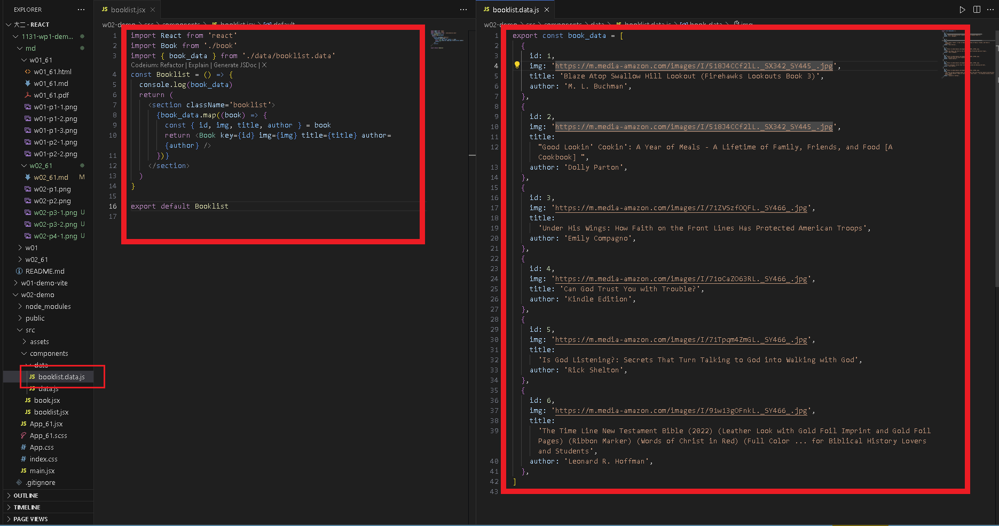

[GITHUB](https://github.com/haowei212410061/1131-wp1-demo-61)

### W02-P1: Github share to teacher and TA(sian-0018)

#### => W02-P2: Show 6 <book /> in React with responsive

#### w02-P3:Create books_data as json array and put it into <Bookslit_61/>, then create 6 <book_61 />

#### w02-P4: Get 6 different book data , adn show these 6 data correctly

