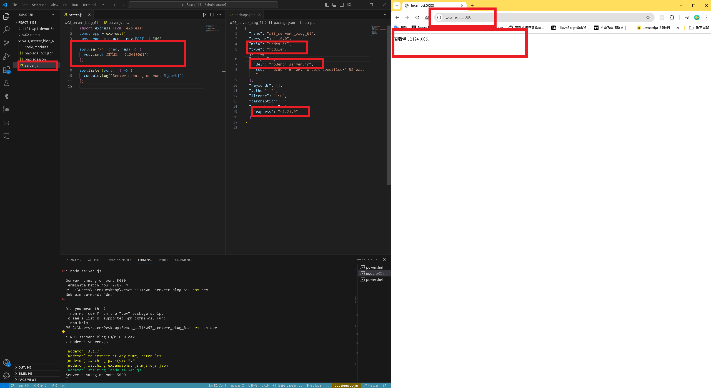
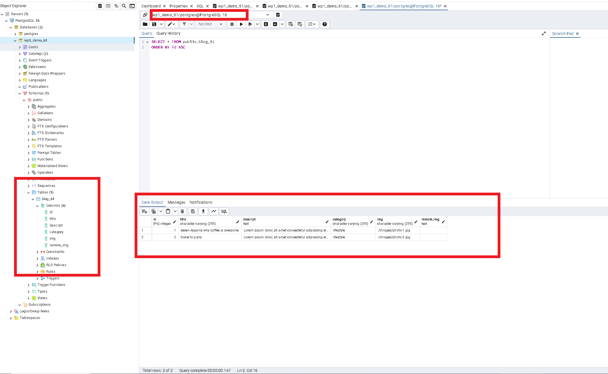
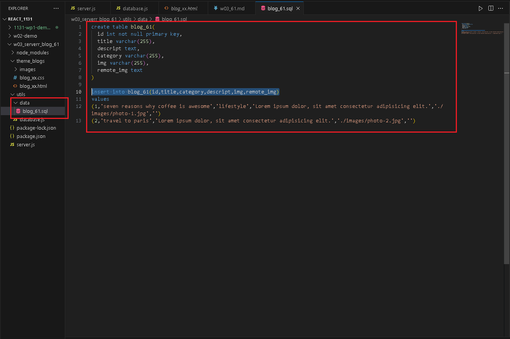

[GITHUB](https://github.com/haowei212410061/1131-wp1-demo-61)

### W03-P1: Create an express Web server and show your name and ID



#### => W03-P2: Create wp1_demo_61 database with a table blog_61, and put 2 data into blog_61

#### => pgAdmin



#### => sql



#### w03-P3:Create books_data as json array and put it into <Bookslit_61/>, then create 6 <book_61 />


#### w03-P4: Get 6 different book data , adn show these 6 data correctly


```

```
