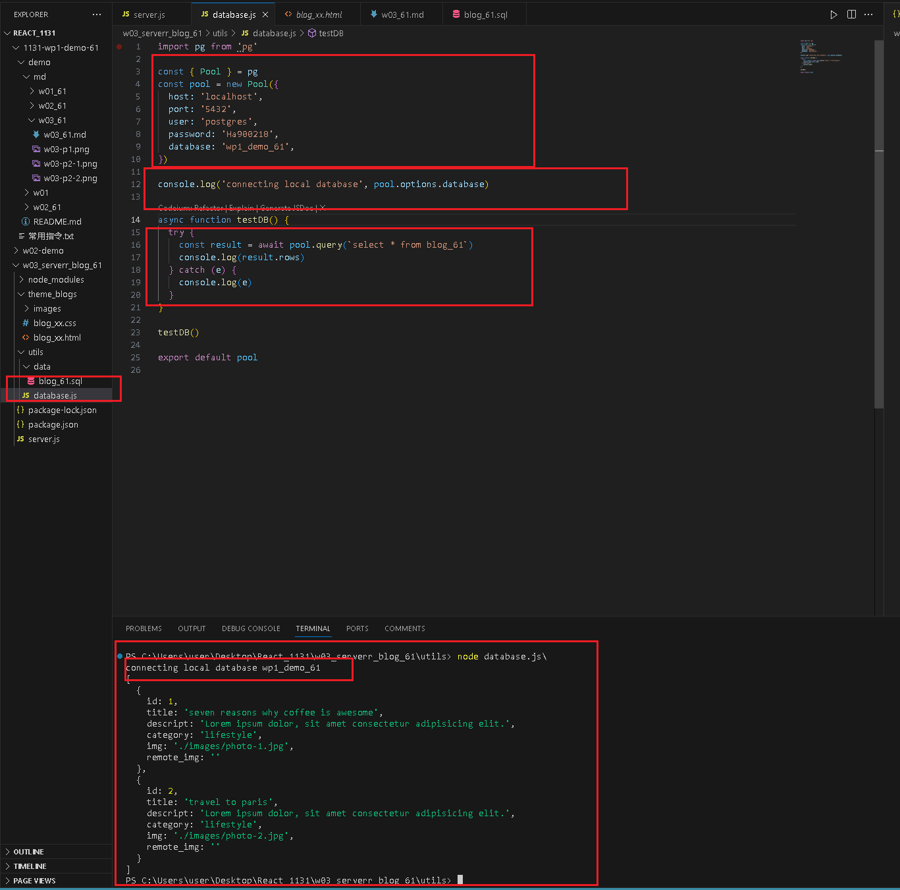
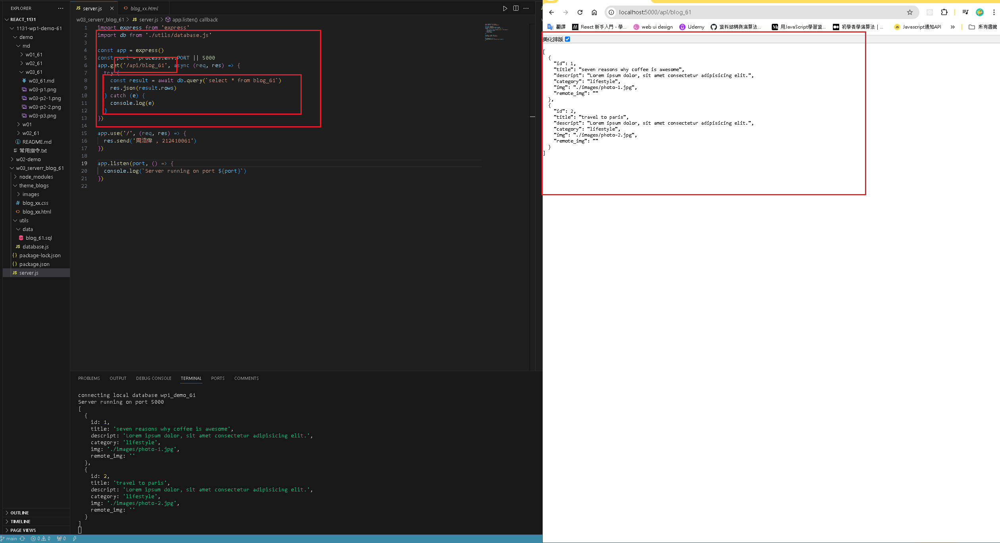

[GITHUB](https://github.com/haowei212410061/1131-wp1-demo-61)

### W03-P1: Create an express Web server and show your name and ID


#### => W03-P2: Create wp1_demo_61 database with a table blog_61, and put 2 data into blog_61

#### => pgAdmin


#### => sql


#### W03-P3: Create database.js to connect blog_xx as in P2 and show 2 data



#### W03-P4: Using route /api/blog_xx to get json data and show it in the browser



### W03-P5: Using route /api/blog_xx to get json data from Supabase, and show it in the browser

```
29f20cd haowei  Wed Sep 25 20:54:31 2024 +0800  W03-P5: Using route /api/blog_xx to get json data from Supabase, and show it in
the browser
91f6db3 haowei  Wed Sep 25 20:32:13 2024 +0800  W03-P4: Using route /api/blog_xx to get json data and show it in the browser
3769fe4 haowei  Wed Sep 25 20:08:42 2024 +0800  W03-P3: Create database.js to connect blog_xx as in P2 and show 2 data
6024fc8 haowei  Wed Sep 25 19:41:20 2024 +0800  W03-P2: Create wp1_demo_61 database with a table blog_61, and put 2 data into blog_61
893f4e3 haowei  Wed Sep 25 19:00:37 2024 +0800  ### W03-P1: Create an express Web server and show your name and ID
```
