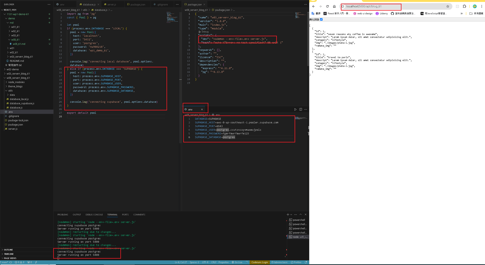
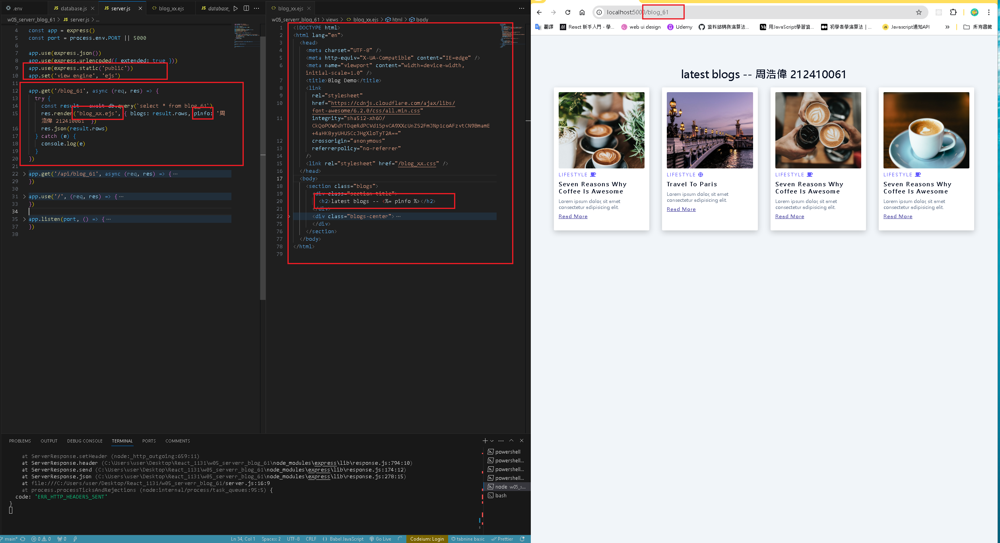
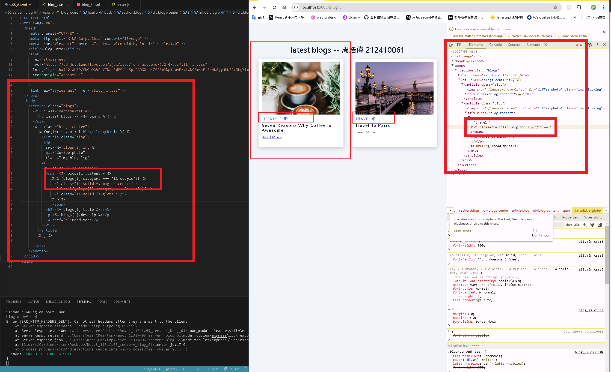

[GITHUB](https://github.com/haowei212410061/1131-wp1-demo-61)

### w05-P1: use .env to connect supabase , and show via route /api/blog_61



```
4070f10 haowei  Wed Oct 9 19:02:06 2024 +0800   w05-P1: use .env to connect supabase , and show via route /api/blog_61
```

#### => w05-P2: use blog theme to create ejs blog_xx.ejs and show your info from pinfo variables




```
4070f10 haowei  Wed Oct 9 19:02:06 2024 +0800   w05-P1: use .env to connect supabase , and show via route /api/blog_61
```

#### w05-P3: Create database.js to connect blog_xx as in P2 and show 2 data



#### w05-P4: Using route /api/blog_xx to get json data and show it in the browser


### w05-P5: Using route /api/blog_xx to get json data from Supabase, and show it in the browser

```

```
