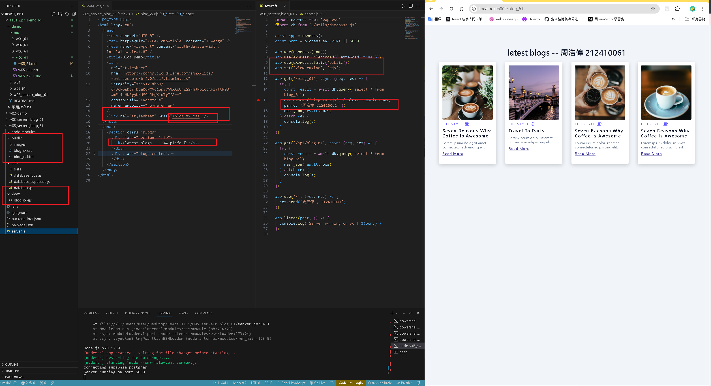

[GITHUB](https://github.com/haowei212410061/1131-wp1-demo-61)

### w05-P1: use .env to connect supabase , and show via route /api/blog_61


```
4070f10 haowei  Wed Oct 9 19:02:06 2024 +0800   w05-P1: use .env to connect supabase , and show via route /api/blog_61
```

#### => w05-P2: use blog theme to create ejs blog_xx.ejs and show your info from pinfo variables




```
b3a3038 haowei  Wed Oct 9 19:59:19 2024 +0800   w05-P2: use blog theme to create ejs blog_xx.ejs and show your info from pinfo variables
4070f10 haowei  Wed Oct 9 19:02:06 2024 +0800   w05-P1: use .env to connect supabase , and show via route /api/blog_61
```

#### W05-P3: Add js code into blog_xx.ejs and show blogs obtained from Supabase blog_61 table


```
3120fda haowei  Wed Oct 9 20:37:29 2024 +0800   W05-P3: Add js code into blog_61.ejs and show blogs obtained from Supabase blog_xx table
b3a3038 haowei  Wed Oct 9 19:59:19 2024 +0800   w05-P2: use blog theme to create ejs blog_xx.ejs and show your info from pinfo variables
4070f10 haowei  Wed Oct 9 19:02:06 2024 +0800   w05-P1: use .env to connect supabase , and show via route /api/blog_61
```

#### w05-P4: refactor p3 code using MVC architecture


### w05-p5: git log

```
8676b72 haowei  Wed Oct 9 21:18:31 2024 +0800   w05-P4: refactor p3 code using MVC architecture
3120fda haowei  Wed Oct 9 20:37:29 2024 +0800   W05-P3: Add js code into blog_61.ejs and show blogs obtained from Supabase blog_xx table
b3a3038 haowei  Wed Oct 9 19:59:19 2024 +0800   w05-P2: use blog theme to create ejs blog_xx.ejs and show your info from pinfo variables
4070f10 haowei  Wed Oct 9 19:02:06 2024 +0800   w05-P1: use .env to connect supabase , and show via route /api/blog_61
```
