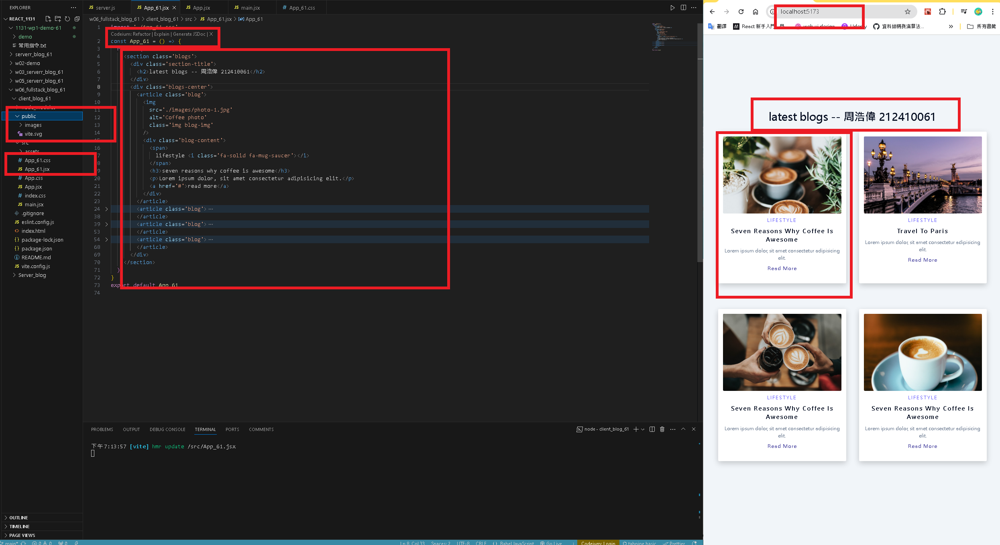
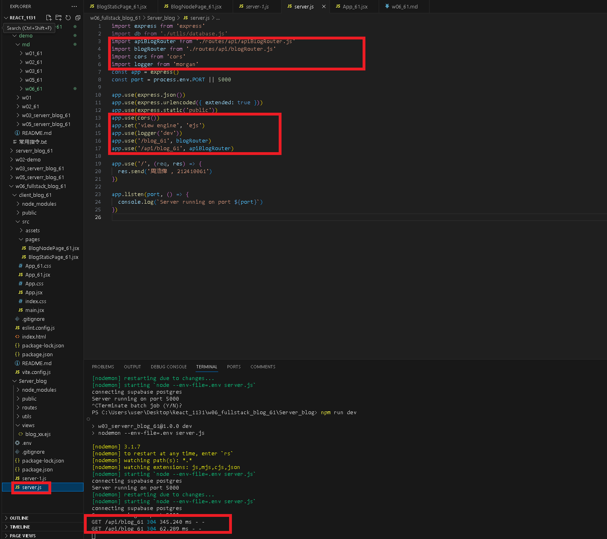
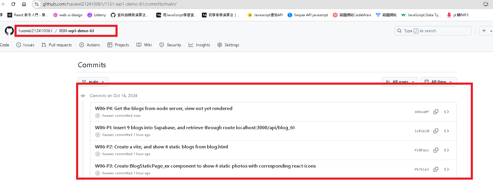

[GITHUB](https://github.com/haowei212410061/1131-wp1-demo-61)

### W06-P1: Insert 9 blogs into Supabase, and retrieve through route localhost:3000/api/blog_xx


```
4070f10 haowei  Wed Oct 9 19:02:06 2024 +0800   w06-P1: use .env to connect supabase , and show via route /api/blog_61
```

#### => W06-P2: Create a vite, and show 4 static blogs from blog.html



#### W06-P3: Create BlogStaticPage_xx component to show 4 static photos with corresponding react-icons


### W06-P4: Get the blogs from node server, view not yet rendered

#### => use console to check if blogs are retrieved from the node server


#### => use React DevTools to view blogs


#### => server setup cors and morgan



### w06-p5: git log



```

```
