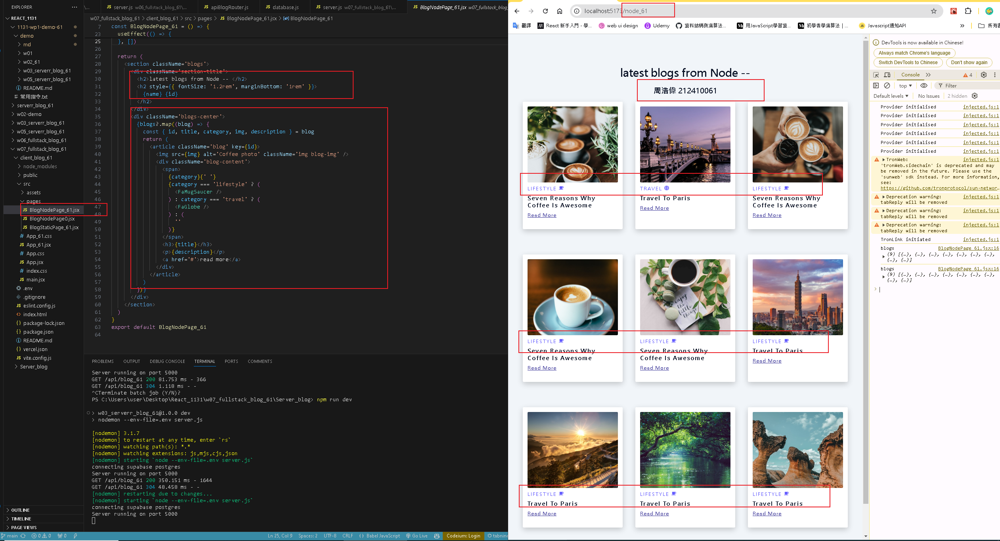

[GITHUB](https://github.com/haowei212410061/1131-wp1-demo-61)

### w07-P1: Get 9 blogs from Node server and show them correctly



```
4070f10 haowei  Wed Oct 9 19:02:06 2024 +0800   w07-P1: use .env to connect supabase , and show via route /api/blog_61
```

#### => w07-P2: Create a vite, and show 4 static blogs from blog.html


#### w07-P3: Create BlogStaticPage_xx component to show 4 static photos with corresponding react-icons


### w07-P4: Get the blogs from node server, view not yet rendered

#### => use console to check if blogs are retrieved from the node server


#### => use React DevTools to view blogs


#### => server setup cors and morgan


### w07-p5: git log


```

```
