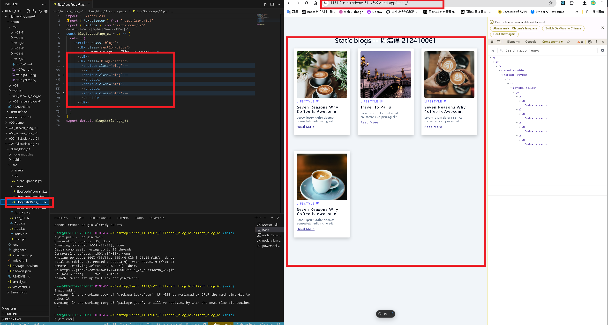
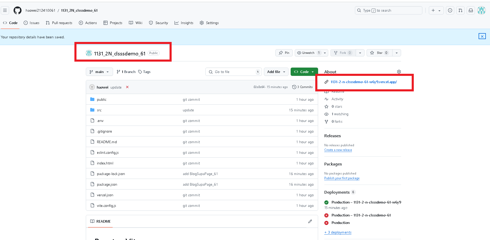
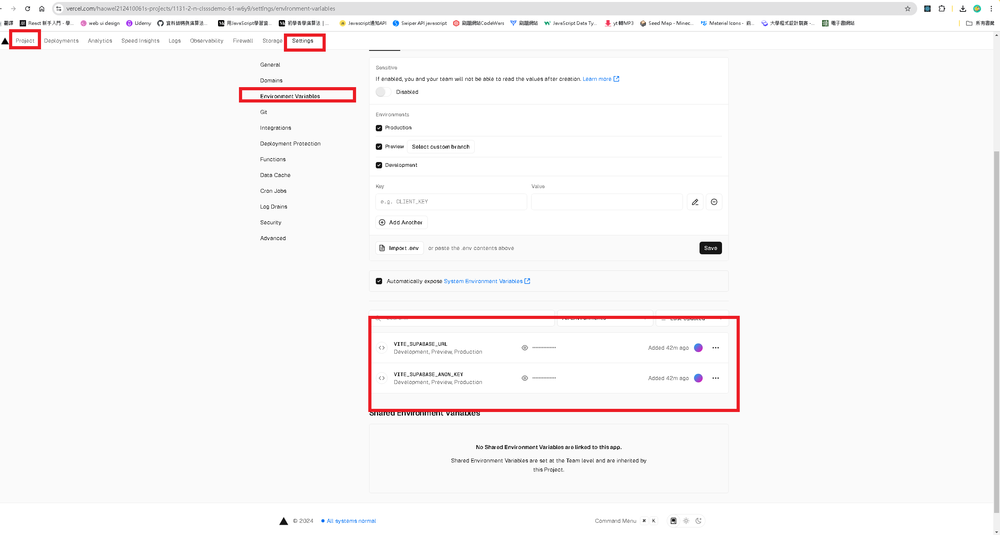

[GITHUB](https://github.com/haowei212410061/1131-wp1-demo-61)

### w07-P1: Get 9 blogs from Node server and show them correctly


```
4070f10 haowei  Wed Oct 9 19:02:06 2024 +0800   w07-P1: use .env to connect supabase , and show via route /api/blog_61
```

#### W07-P2: Deploy Github repo 1131_2N_classdemo_xx to Vercel

#### => Chrome using /static_xx route



#### => Github repo with associated Vercel link



#### => Vercel Project with setttings (environment variable)



#### => W07-P3: Create BlogSupaPage_xx to access blogs from Supabase

#### => from local


#### => from Vercel


### W07-P4: Create Blog-61 component for each blog, and show correctly


### w07-p5: git log

```
c12ae72 haowei  Wed Oct 23 21:08:00 2024 +0800  update
1364bbc haowei  Wed Oct 23 21:06:50 2024 +0800  W07-P4: Create Blog-61 component for each blog, and show correctly
43bf448 haowei  Wed Oct 23 20:38:46 2024 +0800  W07-P2: Deploy Github repo 1131_2N_classdemo_xx to Vercel
ba5dd32 haowei  Wed Oct 23 20:32:06 2024 +0800  W07-P3: Create BlogSupaPage_xx to access blogs from Supabase
e397b67 haowei  Wed Oct 23 19:46:23 2024 +0800  w07-P1: Get 9 blogs from Node server and show them correctly
```
