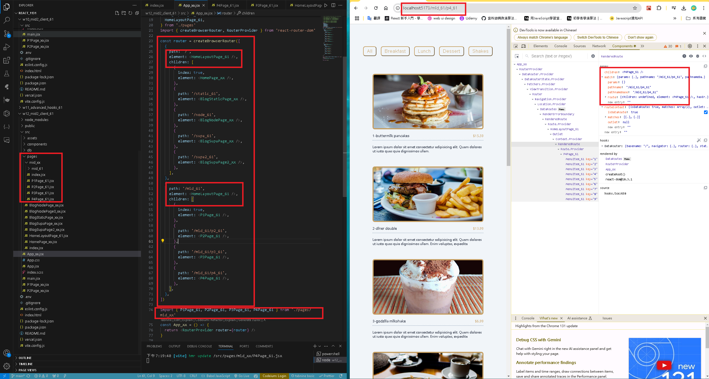
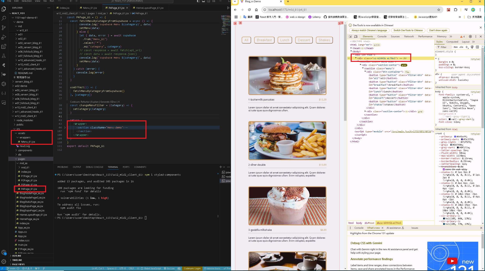
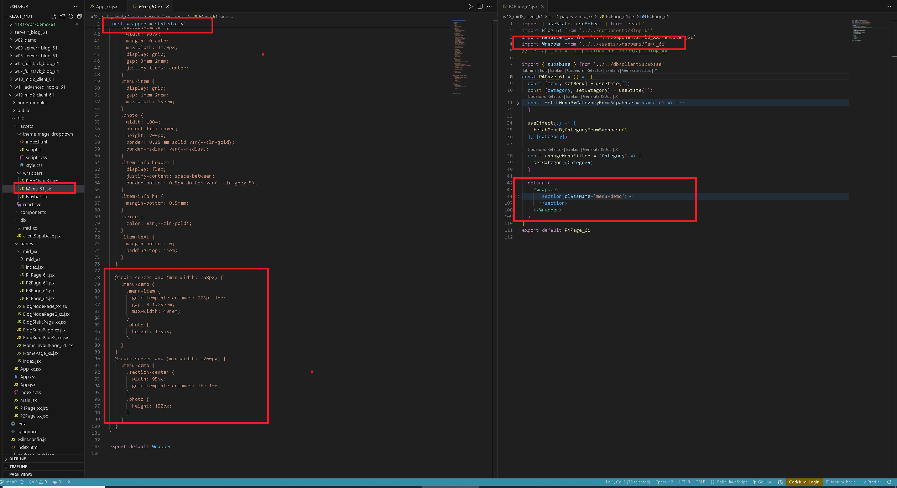
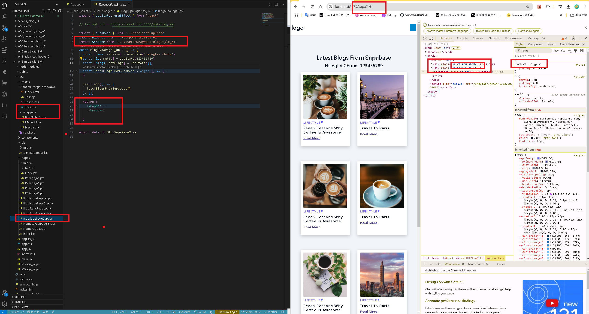
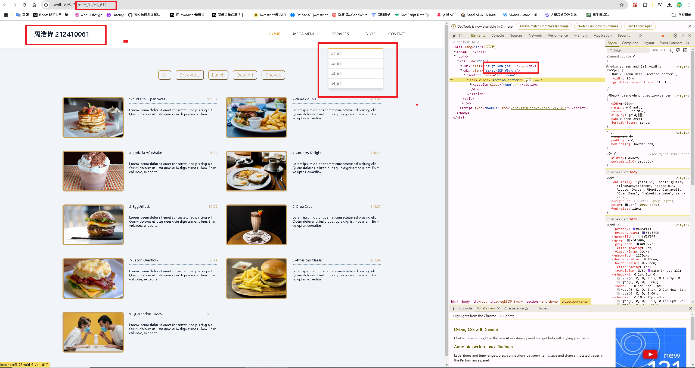
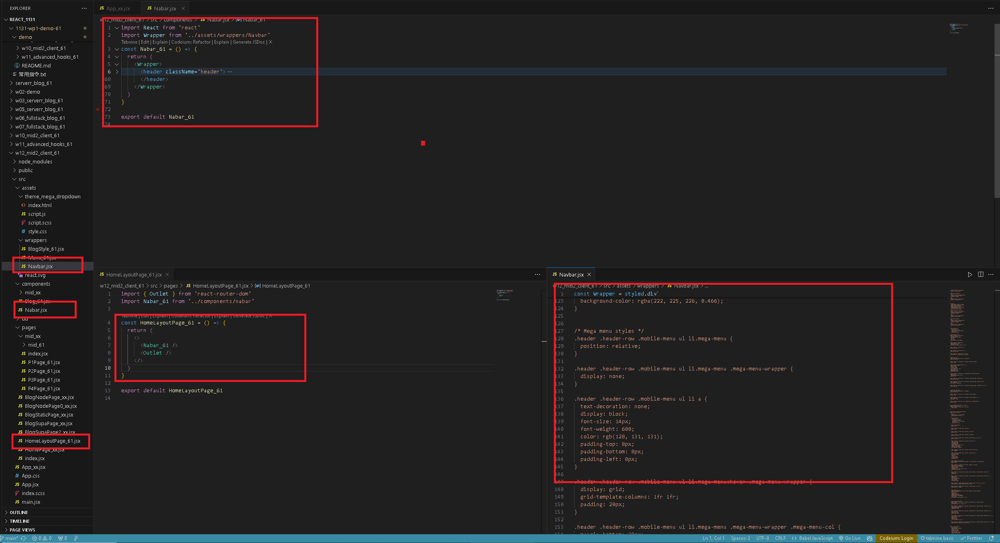

[GITHUB](https://github.com/haowei212410061/1131-wp1-demo-61)

### W12-P1: use createBrowserRouter and RouterProvider to build routes



### W12-P2: Use styled component for Menu and Blog scss, and make it work correctly
 
#### => Show Menu with route /mid_xx/p4_xx
 

 
#### => Show the code using Menu styled component
 

 
#### => Show Blog with route /supa2_xx
 

#### w12-P3: w12-P3: Use ternary operator to show login and logout

#### => initially, no user



#### => press login button



#### => add logout functionality


#### => press logout button


#### w12-P4: git log

```
9dcdf2d haowei  Wed Nov 20 20:46:31 2024 +0800  update w11 demo
54a6085 haowei  Wed Nov 20 20:44:15 2024 +0800  w11-P3: W11-P3: Use ternary operator to show login and logout
6364283 haowei  Wed Nov 20 20:13:08 2024 +0800  w11-P2: toggle alert
45af809 haowei  Wed Nov 20 19:41:21 2024 +0800  W11-P1: Conditonal rendering, show two cases: error and fetch data
```
