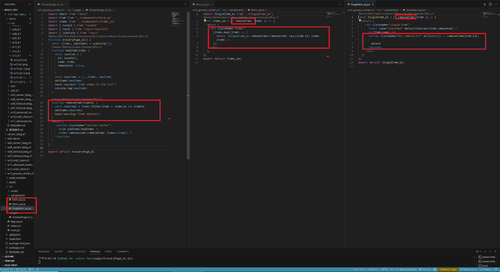
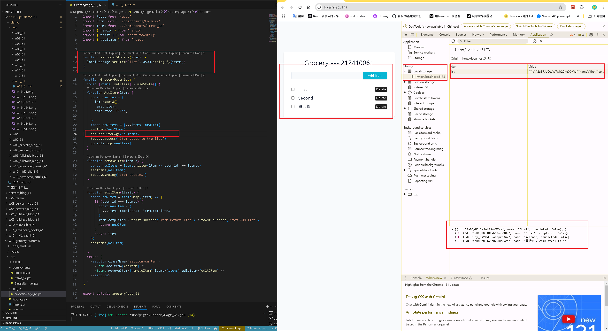
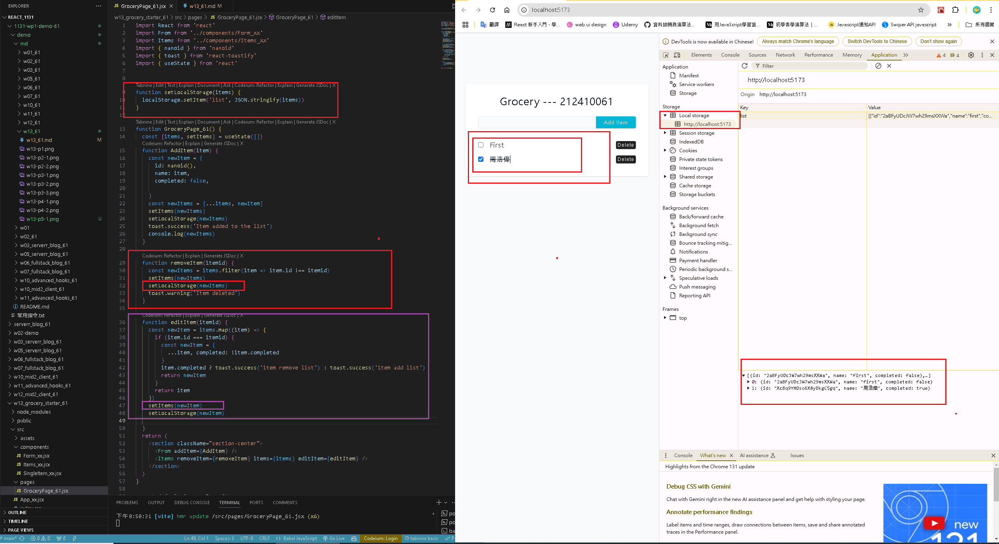

[GITHUB](https://github.com/haowei212410061/1131-wp1-demo-61)

### W13-P1: Show initially the form


### w13-P2: Implement addItem, and display all items 
 
#### => Form_61.jsx,Grocery_61.jsx code
 

 
#### => items_61.jsx,SingleItem_61.jsx code
 

 
#### => Show Blog with route /supa2_xx
 


#### W13-P3: Add react-toastify for alert, implement delete item
 
#### => Show how to make react-toastify work
 

 
#### => Add three items, and remove the second one
 

 
#### => Show how removeItem() being transferred from GroceryPage_xx -> Items_xx -> SingleItem_xx
 



### W13-P4: Implement editItem
 
#### => => Add three items, and edit the third item by pressing checkbox
 

 
#### => Show how editItem() being transferred from GroceryPage_xx -> Items_xx -> SingleItem_xx
 

 

### W13-P5: Use localStorage to get and set items data
 
#### => demo setLocalStorage by addItem
 

 
#### => demo localStorage by editItem, removeItem
 

 
#### => get localStorage when refreshing the browser
 


#### w13-P6: git log 

```
37c70c5 haowei  Wed Dec 4 21:05:19 2024 +0800   W13-P5: Use localStorage to get and set items data
f921c9c haowei  Wed Dec 4 20:42:50 2024 +0800   W13-P4: Implement editItem
7993213 haowei  Wed Dec 4 20:16:30 2024 +0800   W13-P3: Add react-toastify for alert, implement delete item
559c918 haowei  Wed Dec 4 19:29:28 2024 +0800   w13-P2: Implement addItem, and display all items
3cab9c5 haowei  Wed Dec 4 18:39:53 2024 +0800   W13-P1: Show initially the form
```
