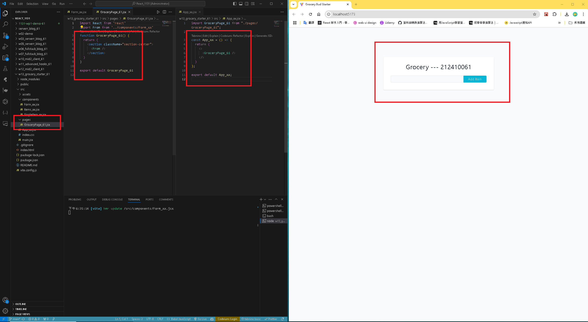
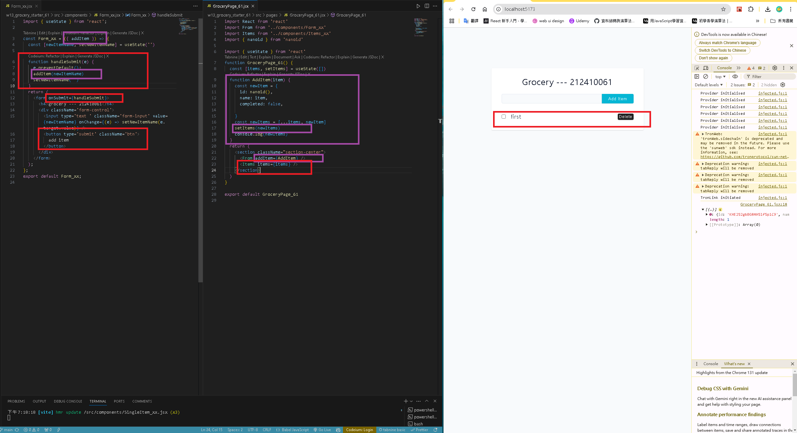
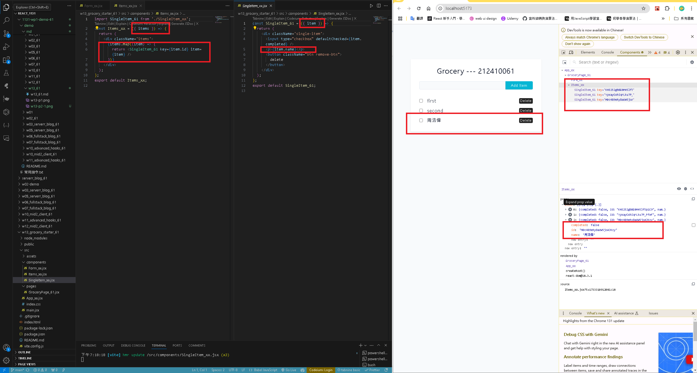
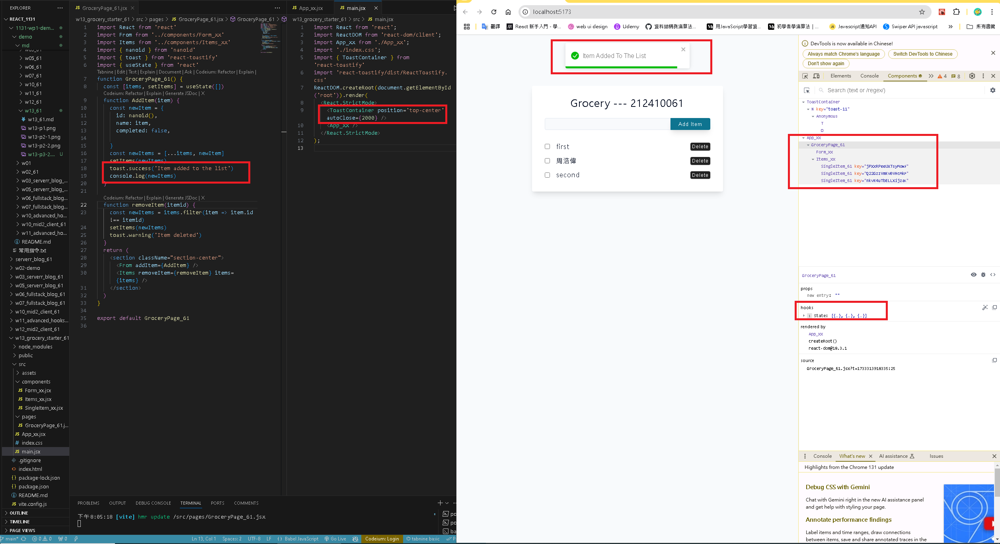
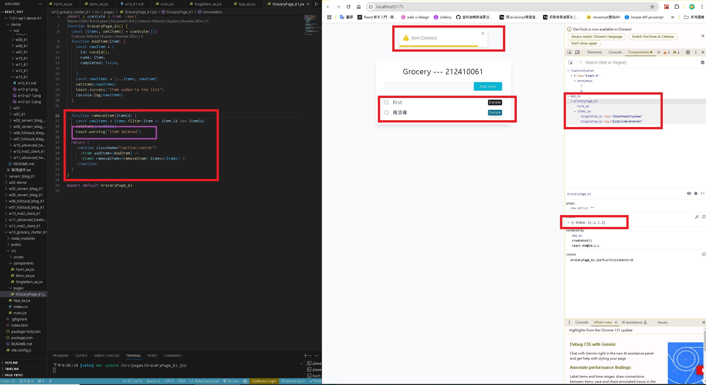

[GITHUB](https://github.com/haowei212410061/1131-wp1-demo-61)

### W13-P1: Show initially the form



### w13-P2: Use styled component for Menu and Blog scss, and make it work correctly
 
#### => Show Menu with route /mid_xx/p4_xx
 

 
#### => Show the code using Menu styled component
 

 
#### => Show Blog with route /supa2_xx
 


#### w13-P3:  Use ternary operator to show login and logout

#### => Chrome demo with code
 

 
#### => source code for HomeLayout_xx.jsx, Navbar_xx (component and css)
 


#### w13-P4: git log

```
f042868 haowei  Wed Nov 27 21:08:43 2024 +0800   w12-P3:  Use ternary operator to show login and logout
09fff25 haowei  Wed Nov 27 21:08:23 2024 +0800  w12-P3:  Use ternary operator to show login and logout
9b048b9 haowei  Wed Nov 27 20:51:20 2024 +0800  W12-P2: Use styled component for Menu and Blog scss, and make it work correctly
0924610 haowei  Wed Nov 27 19:25:04 2024 +0800  W12-P1: use createBrowserRouter and RouterProvider to build routes
```
