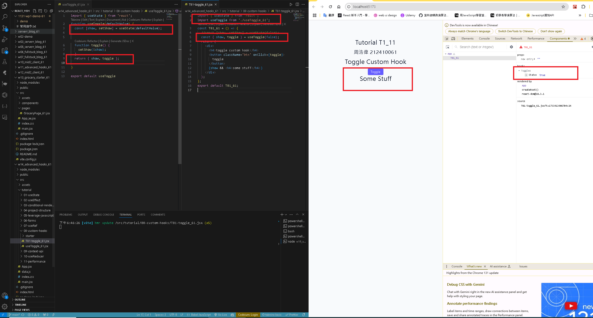
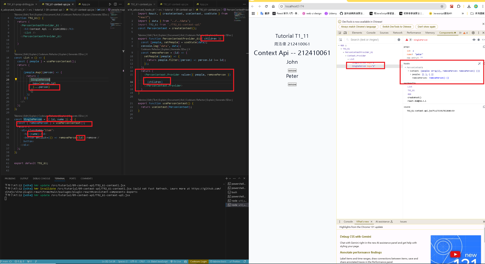

[GITHUB](https://github.com/haowei212410061/1131-wp1-demo-61)

### w14-P1: create a custom hook useToggle to toggle a button



### w14-P2: Convert drop drilling code into context api code

 



#### w14-P3: Add react-toastify for alert, implement delete item
 

 

 
### w14-P4: Implement editItem
 
#### => => Add three items, and edit the third item by pressing checkbox
 

 


#### w14-P5: git log 

```
d0e3a8c haowei  Wed Dec 4 21:06:16 2024 +0800   w14-P6: git log
37c70c5 haowei  Wed Dec 4 21:05:19 2024 +0800   w14-P5: Use localStorage to get and set items data
f921c9c haowei  Wed Dec 4 20:42:50 2024 +0800   w14-P4: Implement editItem
7993213 haowei  Wed Dec 4 20:16:30 2024 +0800   w14-P3: Add react-toastify for alert, implement delete item
559c918 haowei  Wed Dec 4 19:29:28 2024 +0800   w14-P2: Implement addItem, and display all items
3cab9c5 haowei  Wed Dec 4 18:39:53 2024 +0800   w14-P1: Show initially the form
```
