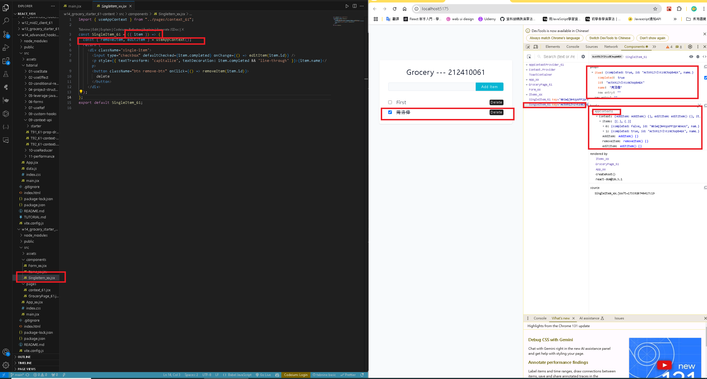
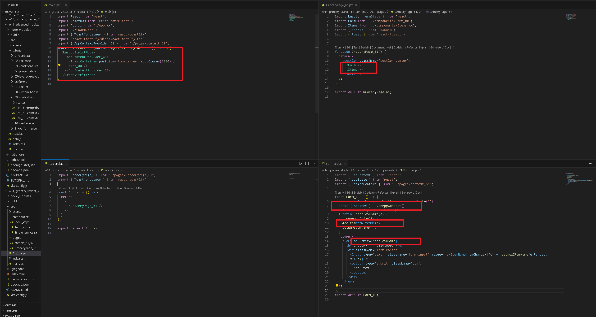
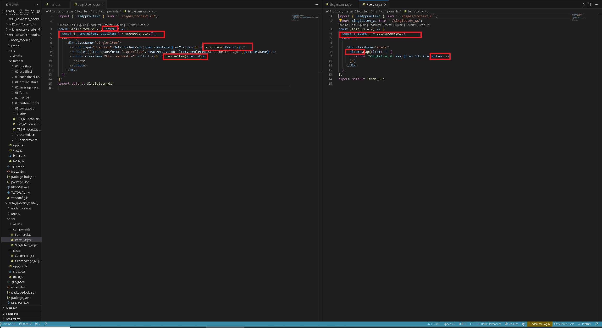

[GITHUB](https://github.com/haowei212410061/1131-wp1-demo-61)

### w14-P1: create a custom hook useToggle to toggle a button


### w14-P2: Convert drop drilling code into context api code

 


#### W14-P3: Convert w13 code into context api code
 
#### => show from Chrome components and SingleItem_xx.jsx
 

 
#### => Show code (main.jsx, App_xx.jsx, Form_xx.jsx)
 

 
#### => Show code (Items_xx.jsx, SingleItems_xx.jsx)
 

 
 
 


#### w14-P4: git log 

```
78e29a9 haowei  Wed Dec 11 21:01:44 2024 +0800  W14-P3: Convert w13 code into context api code
286ab8f haowei  Wed Dec 11 19:52:06 2024 +0800  w14-P2: Convert drop drilling code into context api code
8d88fcd haowei  Wed Dec 11 18:53:40 2024 +0800  w14-P1: create a custom hook useToggle to toggle a button
```
